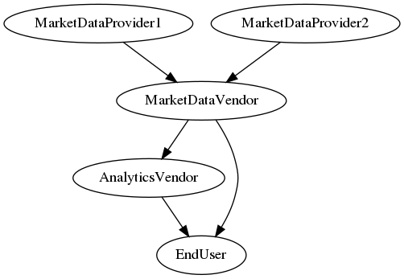

# Reference Application: Market Data Service

## Overview

This application demonstrates the lifecycle of market data subscriptions.
Consumers can acquire licenses to subscribe to either raw data streams or streams enriched by analytics.
Until the license expires, they can use live data streaming or report issues such as performance outage or stale data streams.

## Getting Started

### Installing

**Disclaimer:** This reference application is intended to demonstrate the capabilities of DAML. We recommend that you consider other non-functional aspects, such as security, resiliency, recoverability, etc., prior to production use.

#### Prerequisites

Be sure you have the following installed:
- [DAML SDK](https://docs.daml.com/)
- Java
- Maven

#### Build with Maven

Type:
```shell
mvn clean package
```
**Note:** If you change the DAML models locally, you need to re-run this command before starting the application.

### Starting the App

**Note:** Make sure that you have built the application with Maven (see: [Build with Maven](#build-with-maven)).

1. Start the DAML Sandbox and Navigator. Type:
    ```shell
    daml start --sandbox-option --address=localhost --sandbox-option --wall-clock-time --sandbox-option --ledgerid=market-data-service
    ```
    The navigator will automatically open in new browser tab at http://localhost:7500.
2. Start the automation logic by starting bots and the triggers. Type:
    ```shell
    scripts/startTriggers.sh localhost 6865 target/market-data-service.dar
    java -jar target/market-data-service-0.0.1-SNAPSHOT.jar -ledgerId market-data-service
    ```

### Stopping the App

1. Stop the bots by typing **Ctrl+C**.
1. Stop the Sandbox and the Navigator by typing **Ctrl+C** in the DAML assistant.

### Resetting the Prototype

Reset the application by following these steps:
1.  Stop the app by following the steps in [Stopping the App](#stopping-the-app) section.
2.  Start the app by following the steps in [Starting the App](#starting-the-app) section.

## User Guide

This User Guide will take you step-by-step through the process of subscribing to market data streamed by publishers. It will lead you through all the major Navigator screens and data fields that you will need to use.

After working through these steps, you can use the Navigator interface to explore other functionality that is available in the application.

_Note_: This demo is designed to show a successful conclusion of the workflow without exceptions or error conditions. A full production implementation would include additional features, handle errors and exceptions, and incorporate appropriate security controls.

## Workflow

### Roles and Responsibilities

There are two fundamental role categories in the business model: _publisher_ and _consumer_.
The publisher streams some market data, observable by its consumers via their licenses. The diagram below shows the publisher-consumer relationships created by the market setup.



|         Role       | Responsibilities
| :----------------: | :---
|       Operator     | Represents the infrastructure. Operates model clock, builds relationships between parties, etc.
| MarketDataProvider | Provides raw market data. Can reset raw data stream by loading new CSV content. There are two parties in this role.
|  MarketDataVendor  | Collates raw market data streams. Currently just republishes them without any transformation.
|   AnalyticsVendor  | Enriches raw market data using analytical business knowledge and publishes the enriched data. Currently it calculates accrued interest using Act/365 Fixed daycount convention.
|      EndUser       | The data buyer, subscribed to both enriched data and raw data.

## Running the Application

### Choosing and Changing Roles

When you launch Market Data Service application, you will see the Navigator screen with the option to choose your role.

To log in:

*   On the home screen, select the party from the list.

To switch users:

1. Click the name of the current party at the top of the screen.
2. On the home screen, select a different party.

*Note*: A convenient way to switch between parties is to open separate browsers, e.g., using a private browsing or incognito window.

### Setting the Model Time

For better interoperability and demo experience, the model time is emulated by contracts on the ledger.
Therefore, the system time (coming from your operating system) and the model time (mainly used to make time-based decisions in the model) are separate concepts, including their speed.
You can observe the model time as any party on the _CurrentTime_ contract.
You will also need to continue/stop/set time as the Operator to follow the demo workflow as described in the steps below.

### Market Setup

The participants listed above in Roles and Responsibilities are added automatically at market setup along with other required reference data.
The publisher-consumer relationships are also set up to ease license issuance.
The raw market data providers load an initial CSV content to publish market observations.

### Workflow 1: Observation of Preloaded Data Streams

#### Enabling Model Time Progressing

1. Log in as *Operator*.
2. Select the *Time Management* tab.
3. Select the *Time Manager* contract.
4. Select the choice *Continue*.

#### Observing Market Data Forwarded by MarketDataVendor

1. Log in as *MarketDataVendor*.
2. Select the *DataStreams: Received data* tab (or the *DataStreams: Sent data* tab).
3. Review the incoming market data that is displayed.
4. Wait 5 seconds.
5. Observe the updated market data.
6. (Optional) Check *Include archived* to see previously published data.

#### Observing Market Data Received by EndUser

1. Log in as *EndUser*.
2. Select the *DataStreams: Received data* tab.
3. Review the incoming market data that is displayed.
4. Wait 5 seconds.
5. Observe the updated market data.

### Workflow 2: New Data Stream Subscription

#### Requesting Subscription for AnalyticsVendor to EU Bond Market

1. Log in as *AnalyticsVendor*.
2. Select the *Relationships* tab.
3. Select the contract where *My Role* is *Consumer*.
4. Select the choice *RequestStandardWeeklyStream*.
5. Fill the market, instrumentId, maturity date *exactly* as shown here:
   - European Bond Market
   - ISIN 123 1244
   - 2021 Mar 20

*Note*: You could also select the most general choice *RequestStream*, which allows you to customize the license, for example:
  - starting: 2019 Nov 01 00:00
  - ending: 2019 Dec 31 00:00
  - staleHours: 2

#### Replying to Subscription with a Proposal

1. Log in as *MarketDataVendor*.
2. Select the *Stream Requests* tab.
3. Select the *Received* *DataStreamRequest* contract.
4. Select the choice *DataStreamRequest_Propose*.
5. Fill the price: 100

#### Accepting the Proposal

1. Log in as *AnalyticsVendor*.
2. Select the *License Proposals* tab.
3. Select the *Received* *DataLicenseProposal* contract.
4. Select the choice *DataLicenseProposal_Accept*.

The *Licenses* tab shows that the license automatically goes *live* as does the data stream (*Data Streams: Received data* tab).

#### Enabling Model Time Progressing

1. Log in as *Operator*.
2. Select the *Time Management* tab.
3. Select the *Time Manager* contract.
4. Select the choice *Continue*.

#### Observing Market Data Received by AnalyticsVendor

1. Log in as *AnalyticsVendor*.
2. Select the *DataStreams: Received data* tab.
3. Review the incoming market data showed.
4. Wait 5 seconds.
5. Observe the updated market data.


### Workflow 3: Starting a New Raw Data Stream by Uploading a Market Data CSV
#### Loading the Actual Raw Data

1. Log in as *MarketDataProvider1*.
2. Select the *Data Provider Role* tab.
3. Select the role contract.
4. Select the choice *LoadCsvDataFromPath*.
5. Fill the parameters
   - path (a CSV file under directory `data`): au-market.csv
   - market: AU Bond Market
   - instrumentId: ISIN 789
   - maturity date: 2021 Apr 25
This step creates a contract on the ledger which triggers the appropriate bot to load data from a file under `data/<path-provided>` (see `data/au-market.csv` for the actual data).  While it may be an abuse of the model (storing configuration data on the ledger) and the Navigator (specifying a file on the UI), it provides a convenient way to upload data from a CSV file.

#### Subcribing to the Uploaded Raw Data

Repeat the steps from Workflow 2 but with different parties:
  - consumer is *MarketDataVendor* (in Workflow 2 it was *AnalyticsVendor*)
  - publisher is *MarketDataProvider1* (in Workflow 2 it was *MarketDataVendor*)

See the steps below for the details.

#### Requesting Subscription for MarketDataVendor to AU Bond Market

1. Log in as *MarketDataVendor*.
2. Select the *Relationships* tab.
3. Select the contract where *My Role* is *Consumer*.
4. Select the choice *RequestStandardWeeklyStream*.
5. Fill the market, instrumentId, maturity date *exactly* as shown here:
   - AU Bond Market
   - ISIN 789
   - 2021 Apr 25

#### Replying to Subscription with a Proposal

1. Log in as *MarketDataProvider1*.
2. Select the *Stream Requests* tab.
3. Select the *Received* *DataStreamRequest* contract.
4. Select the choice *DataStreamRequest_Propose*.
5. Fill in the price: 200

#### Accepting the Proposal

1. Log in as *MarketDataVendor*.
2. Select the *License Proposals* tab.
3. Select the *Received* *DataLicenseProposal* contract.
4. Select the choice *DataLicenseProposal_Accept*.

The *Licenses* tab shows that the license automatically goes *live* as does the data stream (*Data Streams: Received data* tab).

#### Enabling Model Time Progressing

1. Log in as *Operator*.
2. Select the *Time Management* tab.
3. Select the *Time Manager* contract.
4. Select the choice *Continue*.

#### Observing Market Data Received by MarketDataVendor

1. Log in as *MarketDataVendor*.
2. Select the *DataStreams: Received data* tab.
3. Review the incoming market data that is displayed.
4. Wait 5 seconds.
5. Observe the updated market data.


### Workflow 4: Expiration

To demonstrate expiration, the EndUser's license for MarketDataVendor is shorter than the others -- only 5 days long.

#### Observing Different License Expiration Dates

1. Log in as *EndUser*.
2. Select the *Licenses* tab.
3. Note the license expirations: 2019-11-20 12:30 and 2019-11-22 12:30.

#### Enabling Model Time Progressing

1. Log in as *Operator*.
2. Select the *Time Management* tab.
3. Select the *Time Manager* contract.
4. Select the choice *Continue*.

#### Setting Time Near to Expiry to Avoid Waiting

1. Log in as *Operator*.
2. Select the *Time Management* tab.
3. Select the *Time Manager* contract.
4. Select the choice *SetCurrentTime*.
5. Fill 2019-11-20 00:00

#### Observing Market Data Received by EndUser

1. Log in as *EndUser*.
2. Select the *DataStreams: Received data* tab.
3. Review the incoming market data showed.
4. Wait until the first expiry date.
5. Observe that after the first expiry date, but before the second expiry date, the incoming data stream from MarketDataVendor has disappeared.

### Workflow 5: Claiming Non-Performance

To demonstrate recording a complaint when the publisher does not perform, you need to start over the application _without_ the bots, so intentionally skip the `java -jar ...` command.
Consequently the data stream is not started, so the consumer can make a complaint.

#### Enabling Model Time Progressing and Pass the Streaming Start Time

1. Log in as *Operator*.
2. Select the *Time Management* tab.
3. Select the *Time Manager* contract.
4. Select the choice *Continue*.
5. Select the choice *AdvanceCurrentTime*.

#### Claiming Non-Performance

1. Log in as *EndUser*.
2. Select the *Licenses* tab.
3. Select any license.
4. Select the choice *RegisteredDataLicense_ClaimNonPerformance*.

#### Observing Complaints

1. Log in as *EndUser*.
2. Select the *Complaints: NonPerformance* tab.
3. Review the created complaints.

*Note*: you should not start the bots after these steps, as the market setup is damaged.

### Workflow 6: Claiming Stale Data

To demonstrate recording a complaint when the publisher streams stale data, you need to start the application as usually, but then _stop_ the bots, so intentionally break with *Ctrl+C* the `java -jar ...` command.
Consequently the data stream will not be re-published, so the consumer can make a complaint.

#### Enabling Model Time Progressing and Pass the Stale Time

1. Log in as *Operator*.
2. Select the *Time Management* tab.
3. Select the *Time Manager* contract.
4. Select the choice *Continue*.
5. Select and exercise 3 times the choice *AdvanceCurrentTime*.
6. Make sure the model time is advanced by at least 3 hours.

#### Claiming Stale Data

1. Log in as *EndUser*.
2. Select the *DataStreams: Received data* tab.
3. Remember the contract Id of the publication received from *MarketDataVendor*, probably something similar to `#110:7`.
4. Select the *Licenses* tab.
5. Select the license with *MarketDataVendor*.
6. Select the choice *ClaimStale*.
7. Fill the contract Id.

#### Observing Complaints

1. Log in as *EndUser*.
2. Select the *Complaints: StaleData* tab.
3. Review the created complaints.

*Note*: you should not start the bots after these steps, as the market setup is damaged.

## Additional Exploration

After completing the workflow, you can explore the application to try other paths such as loading custom CSV and so on.

CONFIDENTIAL © 2019 Digital Asset (Switzerland) GmbH and/or its affiliates. All rights reserved.
Any unauthorized use, duplication or distribution is strictly prohibited.
